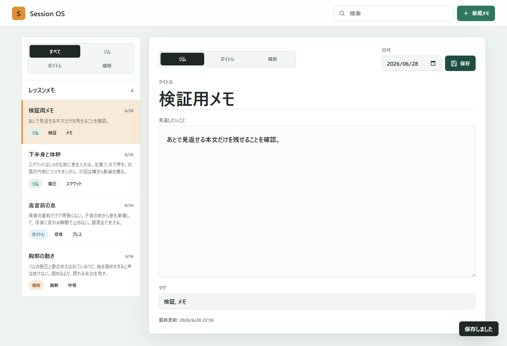
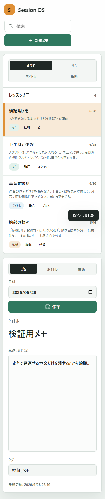

# Session OS

パーソナルジムとボイトレで聞いたことを、あとから見返すためのシンプルなレッスンメモです。

細かく管理するより、読み返したときに「そうやったわ」と思い出せることだけを残す想定です。

## 使い方

`index.html` をブラウザで開くだけで使えます。サーバーやビルドは不要です。

記録はブラウザの `localStorage` に保存されます。同じブラウザで開けば前回の内容が残ります。

## 主な機能

- ジム、ボイトレ、横断メモの切り替え
- メモ履歴、検索、フィルタ
- 新規メモ、保存
- タイトル、日付、本文、タグだけの簡単入力

## スクリーンショット

