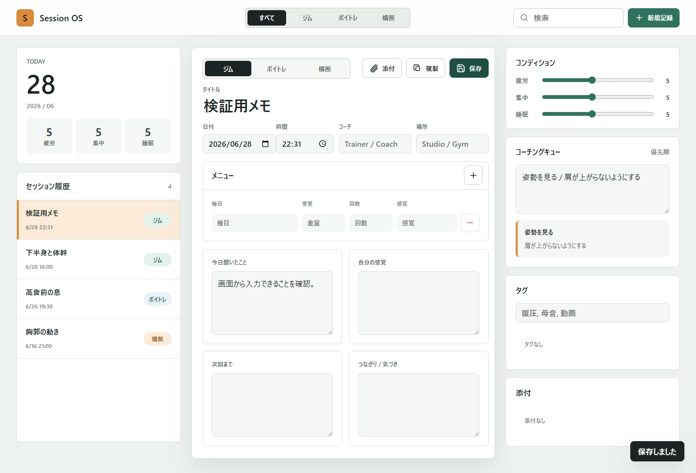
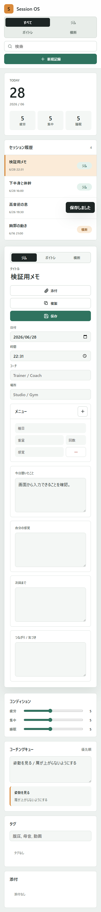

# Session OS

パーソナルジムとボイトレのレッスン内容を、1回ごとのセッションとして整理するためのローカルメモアプリです。

## 使い方

`index.html` をブラウザで開くだけで使えます。サーバーやビルドは不要です。

記録はブラウザの `localStorage` に保存されます。同じブラウザで開けば前回の内容が残ります。

## 主な機能

- ジム、ボイトレ、横断メモの切り替え
- セッション履歴、検索、フィルタ
- 新規記録、複製、保存
- メニュー行の追加と削除
- 今日聞いたこと、自分の感覚、次回まで、つながりのメモ
- コンディション、コーチングキュー、タグ、添付名の管理

## スクリーンショット

